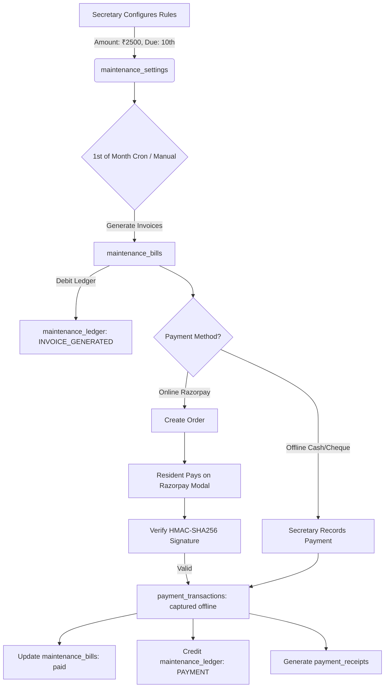

# Sahayak — Backend Implementation Guide Part 4 (Phase 2B: Maintenance Billing, Immutable Financial Ledger & Razorpay Payment Gateway)

> **For Backend Developer (Purvi)**:
> This guide provides the complete, production-grade architectural and implementation specifications for:
> 1. **Society Maintenance Settings & Billing Engine**: Secretary configures flat monthly maintenance fee, due day, and late fee policies.
> 2. **Automated Monthly Invoicing Engine**: Generating monthly flat bills for all occupied units with unique cycle guarantees (`YYYY-MM`).
> 3. **Immutable Financial Ledger System**: Double-entry accounting journal recording every financial event (`INVOICE_GENERATED`, `ONLINE_PAYMENT`, `OFFLINE_PAYMENT`, `PENALTY_ADDED`, `PENALTY_WAIVED`) with running unit balance tracking.
> 4. **Razorpay Online Payment Integration**: End-to-end payment order creation, modal checkout verification using cryptographic HMAC-SHA256 signatures, digital receipt generation, and asynchronous server-to-server webhook reconciliation.
> 5. **Offline Payment Recording (Cash / Cheque / Bank Transfer)**: Secretary workflow to record physical receipts and credit the unit ledger.
> 6. **Defaulter & Financial Analytics**: Collection statistics, outstanding dues tracking, and financial health reports.
>
> **Prerequisites & Database Status**:
> - MySQL Database on AlwaysData cloud is running MySQL 8+.
> - Existing tables: `users`, `societies`, `blocks`, `floors`, `units`, `complaints`, `complaint_replies`.
> - Existing guides: [USER_DB.md](./USER_DB.md), [SOCIETY_STRUCTURE_DB.md](./SOCIETY_STRUCTURE_DB.md), [COMPLAINTS_DB.md](./COMPLAINTS_DB.md), [BACKEND_GUIDE_PART_3.md](./BACKEND_GUIDE_PART_3.md).

---

## Table of Contents
1. [Core Financial Architecture & Workflow](#1-core-financial-architecture--workflow)
   - [1.1 The Equal Split Maintenance Model](#11-the-equal-split-maintenance-model)
   - [1.2 Why a Ledger System? (Zero Financial Drift)](#12-why-a-ledger-system-zero-financial-drift)
   - [1.3 Razorpay Payment Lifecycle & Signature Verification](#13-razorpay-payment-lifecycle--signature-verification)
   - [1.4 Offline Payments (Cash / Cheque / NEFT)](#14-offline-payments-cash--cheque--neft)
   - [1.5 End-to-End System Flowchart](#15-end-to-end-system-flowchart)
2. [Database Schema Design & SQL DDL](#2-database-schema-design--sql-ddl)
   - [2.1 Architectural Rationale & Design Choices](#21-architectural-rationale--design-choices)
   - [2.2 Table 1: `maintenance_settings`](#22-table-1-maintenance_settings)
   - [2.3 Table 2: `maintenance_bills`](#23-table-2-maintenance_bills)
   - [2.4 Table 3: `payment_transactions`](#24-table-3-payment_transactions)
   - [2.5 Table 4: `maintenance_ledger`](#25-table-4-maintenance_ledger)
   - [2.6 Table 5: `payment_receipts`](#26-table-5-payment_receipts)
   - [2.7 Complete Copy-Paste MySQL DDL Script](#27-complete-copy-paste-mysql-ddl-script)
3. [Quick Reference — All API Endpoints](#3-quick-reference--all-api-endpoints)
4. [Section A: Secretary Maintenance APIs](#4-section-a-secretary-maintenance-apis)
   - [API 1: Get Maintenance Settings](#api-1-get-maintenance-settings)
   - [API 2: Update Maintenance Settings](#api-2-update-maintenance-settings)
   - [API 3: Trigger / Generate Monthly Invoices](#api-3-trigger--generate-monthly-invoices)
   - [API 4: List Society Maintenance Bills](#api-4-list-society-maintenance-bills)
   - [API 5: Get Bill Details & Payment History](#api-5-get-bill-details--payment-history)
   - [API 6: Record Offline Payment (Cash / Cheque / Bank Transfer)](#api-6-record-offline-payment)
   - [API 7: Waive Penalty / Adjust Bill](#api-7-waive-penalty--adjust-bill)
   - [API 8: Society Financial Analytics & Defaulters List](#api-8-society-financial-analytics--defaulters-list)
   - [API 9: Society Master Ledger Audit Trail](#api-9-society-master-ledger-audit-trail)
5. [Section B: Resident Maintenance & Payment APIs](#5-section-b-resident-maintenance--payment-apis)
   - [API 10: Get My Unit Dues & Active Balance](#api-10-get-my-unit-dues--active-balance)
   - [API 11: List My Unit Bills](#api-11-list-my-unit-bills)
   - [API 12: Get Bill Invoice Breakdown](#api-12-get-bill-invoice-breakdown)
   - [API 13: Create Razorpay Order](#api-13-create-razorpay-order)
   - [API 14: Verify Payment & Settle Bill](#api-14-verify-payment--settle-bill)
   - [API 15: Get Payment Receipt](#api-15-get-payment-receipt)
   - [API 16: Get My Unit Passbook / Ledger](#api-16-get-my-unit-passbook--ledger)
6. [Section C: Razorpay Webhook Engine](#6-section-c-razorpay-webhook-engine)
   - [API 17: Razorpay Server-to-Server Webhook](#api-17-razorpay-server-to-server-webhook)
7. [Section D: Automated Cron Engine (Monthly Invoicing & Overdue Penalties)](#7-section-d-automated-cron-engine)
8. [Complete Production Code Files](#8-complete-production-code-files)
   - [8.1 `src/config/env.js` Updates](#81-srcconfigenvjs-updates)
   - [8.2 `src/config/razorpay.js`](#82-srcconfigrazorpayjs)
   - [8.3 `src/utils/receiptGenerator.js`](#83-srcutilsreceiptgeneratorjs)
   - [8.4 `src/modules/maintenance/maintenance.service.js`](#84-srcmodulesmaintenancemaintenanceservicejs)
   - [8.5 `src/modules/maintenance/maintenance.controller.js`](#85-srcmodulesmaintenancemaintenancecontrollerjs)
   - [8.6 `src/modules/maintenance/maintenance.routes.js`](#86-srcmodulesmaintenancemaintenanceroutesjs)
   - [8.7 `src/modules/maintenance/maintenance.cron.js`](#87-srcmodulesmaintenancemaintenancecronjs)
   - [8.8 Updates to `src/app.js` & `src/server.js`](#88-updates-to-srcappjs--srcserverjs)
9. [Financial Resilience, Idempotency & Edge Cases](#9-financial-resilience-idempotency--edge-cases)
10. [Step-by-Step Testing Checklist](#10-step-by-step-testing-checklist)

---

## 1. Core Financial Architecture & Workflow

### 1.1 The Equal Split Maintenance Model
In India's Resident Welfare Associations (RWAs) and Housing Societies, maintenance billing starts with one of two models: **Equal Split per Flat** (most common in mid-sized societies) or **Per-Square-Foot Split**.
For Phase 2B, Sahayak implements the **Equal Split per Unit** model:
- The Secretary configures a flat monthly charge (e.g., `₹2,500 / month`).
- Every active, occupied flat in the society receives an invoice for this exact base amount on the 1st of every month (or configured billing day).
- A payment **due day** is configured (e.g., the 10th of every month).
- A **grace period** and **late penalty** can be set (e.g., flat ₹100 or 5% penalty applied if unpaid after due date).

---

### 1.2 Why a Ledger System? (Zero Financial Drift)
A common mistake in beginner billing systems is relying solely on an `is_paid` boolean on an invoice record:
```
// ❌ NAIVE APPROACH (Prone to bugs & financial loss):
UPDATE bills SET status = 'paid' WHERE id = 12;
```
**Why this fails in real life:**
1. What if a resident pays ₹3,000 for a ₹2,500 bill? Where does the extra ₹500 advance go?
2. What if a resident pays by cheque, the bill is marked paid, and 3 days later the cheque bounces?
3. What if Razorpay charges the resident's card, but the resident's Wi-Fi drops before the browser calls `/verify-payment`?
4. What if the Secretary gives a ₹200 festival concession or waives a late fee?
5. How does an auditor verify the society bank account at the end of the financial year?

**The Sahayak Solution — Immutable Ledger System (`maintenance_ledger`)**:
Every monetary movement is recorded as an immutable journal line:
- **Debit (`debit_amount`)**: Increases what the flat owes the society (e.g., bill generated, penalty added).
- **Credit (`credit_amount`)**: Decreases what the flat owes the society (e.g., Razorpay payment captured, cash received, penalty waived).
- **Balance After (`balance_after`)**: The snapshot balance of the flat after this exact entry:
  - `balance > 0`: Flat has outstanding dues.
  - `balance == 0`: Flat is fully settled.
  - `balance < 0`: Flat has advance credit paid forward for next month.

**No ledger row is ever updated or deleted.** If a correction is needed, an offsetting adjustment entry is inserted.

---

### 1.3 Razorpay Payment Lifecycle & Signature Verification
Razorpay is India's leading payment gateway, supporting UPI (Google Pay, PhonePe, Paytm), Credit/Debit Cards, Netbanking, and Wallets.

```
+---------------------------------------------------------------------------------------------------------+
|                                    RAZORPAY PAYMENT LIFECYCLE                                            |
+---------------------------------------------------------------------------------------------------------+

 [Resident UI]                    [Node.js Backend]                [Razorpay Cloud]           [MySQL DB]
       |                                  |                                |                      |
  1. Click "Pay ₹2,500"                   |                                |                      |
       |--- POST /pay/create-order ------>|                                |                      |
       |                                  |-- 2. Validate bill status ---->|                      |
       |                                  |-- 3. orders.create({amount}) ->|                      |
       |                                  |<-- 4. returns order_id --------|                      |
       |                                  |-- 5. Insert transaction (status='created') ---------->|
       |<-- 6. Returns orderId, keyId ----|                                                       |
       |                                                                                          |
  7. Opens Razorpay Checkout Modal                                                                |
     (User enters UPI PIN / Card OTP)                                                             |
       |                                                                                          |
  8. Payment Success Callback                                                                     |
     {order_id, payment_id, signature}                                                            |
       |                                                                                          |
  9. Confirm payment                                                                              |
       |--- POST /pay/verify ------------>|                                                       |
       |                                  |-- 10. Verify HMAC-SHA256 signature                    |
       |                                  |-- 11. Transaction Lock (FOR UPDATE) ----------------->|
       |                                  |-- 12. Mark transaction 'captured' ------------------->|
       |                                  |-- 13. Mark bill 'paid' ------------------------------>|
       |                                  |-- 14. Insert CREDIT in ledger ------------------------>|
       |                                  |-- 15. Generate digital receipt ---------------------->|
       |<-- 16. Returns Receipt JSON -----|                                                       |
```

#### Cryptographic HMAC-SHA256 Signature Verification:
To prevent client-side spoofing, Razorpay generates a signature using your secret key:
$$\text{Expected Signature} = \text{HMAC-SHA256}(\text{order\_id} + \text{"|"} + \text{payment\_id}, \text{RAZORPAY\_KEY\_SECRET})$$
The backend re-computes this exact hash. If `expectedSignature === razorpay_signature`, the payment is mathematically guaranteed authentic.

#### Webhook Backup (Fail-Safe):
If the resident closes their browser tab before Step 9 runs, Razorpay's cloud sends an HTTP POST event (`payment.captured`) to our webhook endpoint (`POST /api/v1/payments/webhook`). The webhook performs the exact same settlement idempotently, ensuring **zero lost payments**.

---

### 1.4 Offline Payments (Cash / Cheque / NEFT)
Not all residents pay online; senior citizens or tenants often pay via cash, bank transfer, or cheque to the Secretary.
- Secretary opens **Record Offline Payment** modal.
- Selects Unit, Bill, Payment Mode (`cash`, `cheque`, `bank_transfer`, `upi_manual`), Amount, Transaction Reference Number, and Notes.
- Backend records an offline `payment_transactions` record, marks the bill paid, credits the ledger, and issues a formal receipt marked `OFFLINE`.

---

### 1.5 End-to-End System Flowchart



---

## 2. Database Schema Design & SQL DDL

### 2.1 Architectural Rationale & Design Choices
1. **`DECIMAL(10, 2)` for All Currency Columns**: Never use `FLOAT` or `DOUBLE` for financial amounts due to IEEE floating-point precision loss. `DECIMAL(10, 2)` guarantees exact cent/paisa arithmetic up to ₹99,999,999.99.
2. **`paise` vs `rupees`**: Razorpay APIs expect amounts in **paise** ($1 \text{ INR} = 100 \text{ paise}$), whereas humans and MySQL store amounts in **Rupees**. The backend converts cleanly:
   $$\text{amountInPaise} = \text{Math.round}(\text{amountInRupees} \times 100)$$
3. **Compound Unique Key `(society_id, unit_id, billing_cycle)`**: A billing cycle string format is `YYYY-MM` (e.g. `'2026-10'`). This database constraint guarantees that duplicate invoices can **never** be generated for the same flat in the same month, even if the cron runs twice.
4. **Referential Integrity (`ON DELETE RESTRICT`)**: Societies, units, bills, and transactions cannot be casually deleted if financial history exists. Financial records must be permanent.
5. **Idempotency Key on Transactions**: Prevents duplicate charge attempts or double-processing of webhook events.

---

### 2.2 Table 1: `maintenance_settings`
Stores society-level maintenance configuration.

| Column | Type | Constraints | Description |
|---|---|---|---|
| `id` | `INT` | `PK`, `AUTO_INCREMENT` | Surrogate primary key |
| `society_id` | `INT` | `NOT NULL`, `UNIQUE`, `FK → societies(id)` | 1:1 relationship with society |
| `monthly_amount` | `DECIMAL(10, 2)` | `NOT NULL`, `CHECK (monthly_amount >= 0)` | Base fee per unit (e.g. `2500.00`) |
| `due_day_of_month` | `TINYINT UNSIGNED` | `NOT NULL`, `DEFAULT 10`, `CHECK (1-28)` | Day of month when payment is due (1–28) |
| `grace_period_days` | `TINYINT UNSIGNED` | `NOT NULL`, `DEFAULT 5` | Extra days before penalty kicks in |
| `late_penalty_type`| `ENUM('none', 'fixed', 'percentage')` | `NOT NULL`, `DEFAULT 'none'` | Penalty calculation type |
| `late_penalty_value`| `DECIMAL(10, 2)`| `NOT NULL`, `DEFAULT 0.00` | Flat fee in INR or percentage (e.g. 5.00%) |
| `bank_account_name`| `VARCHAR(150)`| `NULL` | Society beneficiary account name |
| `bank_account_number`| `VARCHAR(50)`| `NULL` | Society bank account number |
| `bank_ifsc_code` | `VARCHAR(20)` | `NULL` | Bank IFSC code |
| `bank_upi_id` | `VARCHAR(100)` | `NULL` | Society official UPI ID |
| `created_at` | `DATETIME` | `NOT NULL DEFAULT CURRENT_TIMESTAMP` | Row creation timestamp |
| `updated_at` | `DATETIME` | `NOT NULL ON UPDATE CURRENT_TIMESTAMP` | Last config update |

---

### 2.3 Table 2: `maintenance_bills`
Stores monthly invoices generated for each unit.

| Column | Type | Constraints | Description |
|---|---|---|---|
| `id` | `INT` | `PK`, `AUTO_INCREMENT` | Surrogate primary key |
| `society_id` | `INT` | `NOT NULL`, `FK → societies(id)` | Scoped society |
| `unit_id` | `INT` | `NOT NULL`, `FK → units(id)` | Billed apartment unit |
| `resident_id` | `INT` | `NULL`, `FK → users(id)` | Current resident assigned at bill time |
| `bill_number` | `VARCHAR(50)` | `NOT NULL`, `UNIQUE` | Human-readable bill ID, e.g. `BILL-202610-A101` |
| `billing_cycle` | `VARCHAR(7)` | `NOT NULL` | Format `YYYY-MM` (e.g. `2026-10`) |
| `base_amount` | `DECIMAL(10, 2)` | `NOT NULL` | Base maintenance fee |
| `penalty_amount` | `DECIMAL(10, 2)` | `NOT NULL DEFAULT 0.00`| Late fee / penalty applied |
| `discount_amount`| `DECIMAL(10, 2)` | `NOT NULL DEFAULT 0.00`| Concessions or waivers |
| `total_amount` | `DECIMAL(10, 2)` | `NOT NULL` | Net payable: `base + penalty - discount` |
| `paid_amount` | `DECIMAL(10, 2)` | `NOT NULL DEFAULT 0.00`| Total amount settled so far |
| `due_date` | `DATE` | `NOT NULL` | Official deadline date |
| `status` | `ENUM(...)` | `NOT NULL DEFAULT 'unpaid'` | `'unpaid'`, `'partially_paid'`, `'paid'`, `'overdue'` |
| `paid_at` | `DATETIME` | `NULL` | Timestamp of complete payment |
| `notes` | `TEXT` | `NULL` | Custom remarks (e.g., penalty waiver explanation) |
| `created_at` | `DATETIME` | `NOT NULL DEFAULT CURRENT_TIMESTAMP` | Bill generation timestamp |
| `updated_at` | `DATETIME` | `NOT NULL ON UPDATE CURRENT_TIMESTAMP` | Last updated timestamp |

*Unique Key:* `UNIQUE KEY uq_unit_billing_cycle (society_id, unit_id, billing_cycle)`

---

### 2.4 Table 3: `payment_transactions`
Tracks payment orders, payment attempts, and Razorpay transaction states.

| Column | Type | Constraints | Description |
|---|---|---|---|
| `id` | `INT` | `PK`, `AUTO_INCREMENT` | Surrogate primary key |
| `society_id` | `INT` | `NOT NULL`, `FK → societies(id)` | Scoped society |
| `unit_id` | `INT` | `NOT NULL`, `FK → units(id)` | Apartment unit |
| `resident_id` | `INT` | `NOT NULL`, `FK → users(id)` | User making the payment |
| `bill_id` | `INT` | `NULL`, `FK → maintenance_bills(id)`| Associated bill invoice |
| `transaction_type`| `ENUM('online', 'offline')`| `NOT NULL` | Payment channel |
| `payment_gateway`| `VARCHAR(30)` | `NOT NULL DEFAULT 'razorpay'` | `'razorpay'`, `'manual_cash'`, `'bank_transfer'` |
| `razorpay_order_id`| `VARCHAR(100)`| `NULL`, `UNIQUE` | Order ID generated by Razorpay |
| `razorpay_payment_id`| `VARCHAR(100)`| `NULL`, `UNIQUE` | Payment ID returned by Razorpay |
| `razorpay_signature`| `VARCHAR(255)`| `NULL` | HMAC SHA256 signature string |
| `amount` | `DECIMAL(10, 2)` | `NOT NULL` | Transaction amount in INR |
| `currency` | `VARCHAR(5)` | `NOT NULL DEFAULT 'INR'` | Currency code |
| `status` | `ENUM(...)` | `NOT NULL DEFAULT 'created'` | `'created'`, `'authorized'`, `'captured'`, `'failed'`, `'refunded'` |
| `payment_method` | `VARCHAR(50)` | `NULL` | `'upi'`, `'card'`, `'netbanking'`, `'wallet'`, `'cash'`, `'cheque'` |
| `offline_reference`| `VARCHAR(100)`| `NULL` | Cheque number, UTR number, or deposit slip ID |
| `recorded_by_id` | `INT` | `NULL`, `FK → users(id)` | Secretary who recorded offline payment |
| `error_code` | `VARCHAR(100)` | `NULL` | Gateway error code if failed |
| `error_description`| `VARCHAR(500)`| `NULL` | Detailed gateway error message |
| `created_at` | `DATETIME` | `NOT NULL DEFAULT CURRENT_TIMESTAMP` | Order creation timestamp |
| `updated_at` | `DATETIME` | `NOT NULL ON UPDATE CURRENT_TIMESTAMP` | Status change timestamp |

---

### 2.5 Table 4: `maintenance_ledger`
The immutable double-entry journal tracking unit financial history.

| Column | Type | Constraints | Description |
|---|---|---|---|
| `id` | `INT` | `PK`, `AUTO_INCREMENT` | Surrogate primary key |
| `society_id` | `INT` | `NOT NULL`, `FK → societies(id)` | Scoped society |
| `unit_id` | `INT` | `NOT NULL`, `FK → units(id)` | Apartment unit |
| `bill_id` | `INT` | `NULL`, `FK → maintenance_bills(id)`| Related invoice if applicable |
| `transaction_id` | `INT` | `NULL`, `FK → payment_transactions(id)` | Related transaction if payment |
| `entry_type` | `ENUM(...)` | `NOT NULL` | Event type: `'INVOICE_GENERATED'`, `'ONLINE_PAYMENT'`, `'OFFLINE_PAYMENT'`, `'PENALTY_ADDED'`, `'PENALTY_WAIVED'`, `'OPENING_BALANCE'`, `'ADJUSTMENT'` |
| `debit_amount` | `DECIMAL(10, 2)` | `NOT NULL DEFAULT 0.00` | Amount owed increased (Charges) |
| `credit_amount` | `DECIMAL(10, 2)` | `NOT NULL DEFAULT 0.00` | Amount owed decreased (Payments/Discounts) |
| `balance_after` | `DECIMAL(10, 2)` | `NOT NULL` | Running balance after this entry |
| `description` | `VARCHAR(255)` | `NOT NULL` | Human-readable explanation of entry |
| `created_by_id` | `INT` | `NULL`, `FK → users(id)` | User or System (`NULL` for automated) |
| `created_at` | `DATETIME` | `NOT NULL DEFAULT CURRENT_TIMESTAMP` | Immutable entry timestamp |

---

### 2.6 Table 5: `payment_receipts`
Formal receipts generated upon payment capture for download, printing, or accounting audits.

| Column | Type | Constraints | Description |
|---|---|---|---|
| `id` | `INT` | `PK`, `AUTO_INCREMENT` | Surrogate primary key |
| `receipt_number` | `VARCHAR(50)` | `NOT NULL`, `UNIQUE` | Format `RCP-202610-0001` |
| `society_id` | `INT` | `NOT NULL`, `FK → societies(id)` | Scoped society |
| `unit_id` | `INT` | `NOT NULL`, `FK → units(id)` | Unit billed |
| `resident_id` | `INT` | `NOT NULL`, `FK → users(id)` | Resident who paid |
| `bill_id` | `INT` | `NOT NULL`, `FK → maintenance_bills(id)`| Associated invoice |
| `transaction_id` | `INT` | `NOT NULL`, `UNIQUE`, `FK → payment_transactions(id)` | Associated transaction |
| `amount_paid` | `DECIMAL(10, 2)` | `NOT NULL` | Amount paid in INR |
| `payment_mode` | `VARCHAR(50)` | `NOT NULL` | `'online_razorpay'`, `'cash'`, `'cheque'`, `'bank_transfer'` |
| `payment_date` | `DATETIME` | `NOT NULL` | Official date of receipt |
| `issued_by_name` | `VARCHAR(100)` | `NOT NULL` | Society Name or Secretary Name |
| `created_at` | `DATETIME` | `NOT NULL DEFAULT CURRENT_TIMESTAMP` | Record timestamp |

---

### 2.7 Complete Copy-Paste MySQL DDL Script

Purvi should run this exact script in phpMyAdmin on AlwaysData:

```sql
-- =====================================================================
-- SAHAYAK — PHASE 2B: MAINTENANCE BILLING & LEDGER DATABASE MIGRATION
-- Run on AlwaysData MySQL Database
-- =====================================================================

-- 1. Table: maintenance_settings
CREATE TABLE IF NOT EXISTS maintenance_settings (
    id                  INT                     NOT NULL AUTO_INCREMENT,
    society_id          INT                     NOT NULL,
    monthly_amount      DECIMAL(10, 2)          NOT NULL DEFAULT 2000.00,
    due_day_of_month    TINYINT UNSIGNED        NOT NULL DEFAULT 10,
    grace_period_days   TINYINT UNSIGNED        NOT NULL DEFAULT 5,
    late_penalty_type   ENUM('none', 'fixed', 'percentage') NOT NULL DEFAULT 'none',
    late_penalty_value  DECIMAL(10, 2)          NOT NULL DEFAULT 0.00,
    bank_account_name   VARCHAR(150)            NULL,
    bank_account_number VARCHAR(50)             NULL,
    bank_ifsc_code      VARCHAR(20)             NULL,
    bank_upi_id         VARCHAR(100)            NULL,
    created_at          DATETIME                NOT NULL DEFAULT CURRENT_TIMESTAMP,
    updated_at          DATETIME                NOT NULL DEFAULT CURRENT_TIMESTAMP ON UPDATE CURRENT_TIMESTAMP,
    PRIMARY KEY (id),
    UNIQUE KEY uq_settings_society (society_id),
    CONSTRAINT chk_monthly_amount CHECK (monthly_amount >= 0),
    CONSTRAINT chk_due_day CHECK (due_day_of_month >= 1 AND due_day_of_month <= 28),
    CONSTRAINT fk_settings_society FOREIGN KEY (society_id) REFERENCES societies(id) ON DELETE RESTRICT
) ENGINE=InnoDB DEFAULT CHARSET=utf8mb4 COLLATE=utf8mb4_unicode_ci;

-- 2. Table: maintenance_bills
CREATE TABLE IF NOT EXISTS maintenance_bills (
    id                  INT                     NOT NULL AUTO_INCREMENT,
    society_id          INT                     NOT NULL,
    unit_id             INT                     NOT NULL,
    resident_id         INT                     NULL,
    bill_number         VARCHAR(50)             NOT NULL,
    billing_cycle       VARCHAR(7)              NOT NULL, -- 'YYYY-MM'
    base_amount         DECIMAL(10, 2)          NOT NULL,
    penalty_amount      DECIMAL(10, 2)          NOT NULL DEFAULT 0.00,
    discount_amount     DECIMAL(10, 2)          NOT NULL DEFAULT 0.00,
    total_amount        DECIMAL(10, 2)          NOT NULL,
    paid_amount         DECIMAL(10, 2)          NOT NULL DEFAULT 0.00,
    due_date            DATE                    NOT NULL,
    status              ENUM('unpaid', 'partially_paid', 'paid', 'overdue') NOT NULL DEFAULT 'unpaid',
    paid_at             DATETIME                NULL,
    notes               TEXT                    NULL,
    created_at          DATETIME                NOT NULL DEFAULT CURRENT_TIMESTAMP,
    updated_at          DATETIME                NOT NULL DEFAULT CURRENT_TIMESTAMP ON UPDATE CURRENT_TIMESTAMP,
    PRIMARY KEY (id),
    UNIQUE KEY uq_bill_number (bill_number),
    UNIQUE KEY uq_unit_billing_cycle (society_id, unit_id, billing_cycle),
    INDEX idx_bills_society_status (society_id, status),
    INDEX idx_bills_unit (unit_id),
    INDEX idx_bills_cycle (billing_cycle),
    CONSTRAINT chk_amounts CHECK (total_amount >= 0 AND paid_amount >= 0),
    CONSTRAINT fk_bills_society FOREIGN KEY (society_id) REFERENCES societies(id) ON DELETE RESTRICT,
    CONSTRAINT fk_bills_unit FOREIGN KEY (unit_id) REFERENCES units(id) ON DELETE RESTRICT,
    CONSTRAINT fk_bills_resident FOREIGN KEY (resident_id) REFERENCES users(id) ON DELETE RESTRICT
) ENGINE=InnoDB DEFAULT CHARSET=utf8mb4 COLLATE=utf8mb4_unicode_ci;

-- 3. Table: payment_transactions
CREATE TABLE IF NOT EXISTS payment_transactions (
    id                  INT                     NOT NULL AUTO_INCREMENT,
    society_id          INT                     NOT NULL,
    unit_id             INT                     NOT NULL,
    resident_id         INT                     NOT NULL,
    bill_id             INT                     NULL,
    transaction_type    ENUM('online', 'offline') NOT NULL DEFAULT 'online',
    payment_gateway     VARCHAR(30)             NOT NULL DEFAULT 'razorpay',
    razorpay_order_id   VARCHAR(100)            NULL,
    razorpay_payment_id VARCHAR(100)            NULL,
    razorpay_signature  VARCHAR(255)            NULL,
    amount              DECIMAL(10, 2)          NOT NULL,
    currency            VARCHAR(5)              NOT NULL DEFAULT 'INR',
    status              ENUM('created', 'authorized', 'captured', 'failed', 'refunded') NOT NULL DEFAULT 'created',
    payment_method      VARCHAR(50)             NULL, -- 'upi', 'card', 'netbanking', 'cash', 'cheque'
    offline_reference   VARCHAR(100)            NULL,
    recorded_by_id      INT                     NULL,
    error_code          VARCHAR(100)            NULL,
    error_description   VARCHAR(500)            NULL,
    created_at          DATETIME                NOT NULL DEFAULT CURRENT_TIMESTAMP,
    updated_at          DATETIME                NOT NULL DEFAULT CURRENT_TIMESTAMP ON UPDATE CURRENT_TIMESTAMP,
    PRIMARY KEY (id),
    UNIQUE KEY uq_rzp_order (razorpay_order_id),
    UNIQUE KEY uq_rzp_payment (razorpay_payment_id),
    INDEX idx_tx_bill (bill_id),
    INDEX idx_tx_status (status),
    CONSTRAINT fk_tx_society FOREIGN KEY (society_id) REFERENCES societies(id) ON DELETE RESTRICT,
    CONSTRAINT fk_tx_unit FOREIGN KEY (unit_id) REFERENCES units(id) ON DELETE RESTRICT,
    CONSTRAINT fk_tx_resident FOREIGN KEY (resident_id) REFERENCES users(id) ON DELETE RESTRICT,
    CONSTRAINT fk_tx_bill FOREIGN KEY (bill_id) REFERENCES maintenance_bills(id) ON DELETE RESTRICT,
    CONSTRAINT fk_tx_recorder FOREIGN KEY (recorded_by_id) REFERENCES users(id) ON DELETE RESTRICT
) ENGINE=InnoDB DEFAULT CHARSET=utf8mb4 COLLATE=utf8mb4_unicode_ci;

-- 4. Table: maintenance_ledger
CREATE TABLE IF NOT EXISTS maintenance_ledger (
    id                  INT                     NOT NULL AUTO_INCREMENT,
    society_id          INT                     NOT NULL,
    unit_id             INT                     NOT NULL,
    bill_id             INT                     NULL,
    transaction_id      INT                     NULL,
    entry_type          ENUM(
                            'INVOICE_GENERATED',
                            'ONLINE_PAYMENT',
                            'OFFLINE_PAYMENT',
                            'PENALTY_ADDED',
                            'PENALTY_WAIVED',
                            'OPENING_BALANCE',
                            'ADJUSTMENT'
                        )                       NOT NULL,
    debit_amount        DECIMAL(10, 2)          NOT NULL DEFAULT 0.00,
    credit_amount       DECIMAL(10, 2)          NOT NULL DEFAULT 0.00,
    balance_after       DECIMAL(10, 2)          NOT NULL,
    description         VARCHAR(255)            NOT NULL,
    created_by_id       INT                     NULL,
    created_at          DATETIME                NOT NULL DEFAULT CURRENT_TIMESTAMP,
    PRIMARY KEY (id),
    INDEX idx_ledger_unit (society_id, unit_id, created_at),
    INDEX idx_ledger_bill (bill_id),
    INDEX idx_ledger_type (entry_type),
    CONSTRAINT fk_ledger_society FOREIGN KEY (society_id) REFERENCES societies(id) ON DELETE RESTRICT,
    CONSTRAINT fk_ledger_unit FOREIGN KEY (unit_id) REFERENCES units(id) ON DELETE RESTRICT,
    CONSTRAINT fk_ledger_bill FOREIGN KEY (bill_id) REFERENCES maintenance_bills(id) ON DELETE RESTRICT,
    CONSTRAINT fk_ledger_tx FOREIGN KEY (transaction_id) REFERENCES payment_transactions(id) ON DELETE RESTRICT,
    CONSTRAINT fk_ledger_creator FOREIGN KEY (created_by_id) REFERENCES users(id) ON DELETE RESTRICT
) ENGINE=InnoDB DEFAULT CHARSET=utf8mb4 COLLATE=utf8mb4_unicode_ci;

-- 5. Table: payment_receipts
CREATE TABLE IF NOT EXISTS payment_receipts (
    id                  INT                     NOT NULL AUTO_INCREMENT,
    receipt_number      VARCHAR(50)             NOT NULL,
    society_id          INT                     NOT NULL,
    unit_id             INT                     NOT NULL,
    resident_id         INT                     NOT NULL,
    bill_id             INT                     NOT NULL,
    transaction_id      INT                     NOT NULL,
    amount_paid         DECIMAL(10, 2)          NOT NULL,
    payment_mode        VARCHAR(50)             NOT NULL,
    payment_date        DATETIME                NOT NULL,
    issued_by_name      VARCHAR(100)            NOT NULL,
    created_at          DATETIME                NOT NULL DEFAULT CURRENT_TIMESTAMP,
    PRIMARY KEY (id),
    UNIQUE KEY uq_receipt_number (receipt_number),
    UNIQUE KEY uq_receipt_tx (transaction_id),
    INDEX idx_receipts_unit (unit_id),
    CONSTRAINT fk_receipt_society FOREIGN KEY (society_id) REFERENCES societies(id) ON DELETE RESTRICT,
    CONSTRAINT fk_receipt_unit FOREIGN KEY (unit_id) REFERENCES units(id) ON DELETE RESTRICT,
    CONSTRAINT fk_receipt_resident FOREIGN KEY (resident_id) REFERENCES users(id) ON DELETE RESTRICT,
    CONSTRAINT fk_receipt_bill FOREIGN KEY (bill_id) REFERENCES maintenance_bills(id) ON DELETE RESTRICT,
    CONSTRAINT fk_receipt_tx FOREIGN KEY (transaction_id) REFERENCES payment_transactions(id) ON DELETE RESTRICT
) ENGINE=InnoDB DEFAULT CHARSET=utf8mb4 COLLATE=utf8mb4_unicode_ci;
```

---

## 3. Quick Reference — All API Endpoints

### Section A: Secretary Maintenance APIs
| # | Method | Endpoint | Auth Role | Description |
|---|---|---|---|---|
| **1** | `GET` | `/api/v1/secretary/maintenance/settings` | `secretary` | View society fee, due day, and bank configuration |
| **2** | `PUT` | `/api/v1/secretary/maintenance/settings` | `secretary` | Update monthly amount, due date & penalty rule |
| **3** | `POST` | `/api/v1/secretary/maintenance/generate-bills` | `secretary` | Manually trigger bill generation for a cycle (`YYYY-MM`) |
| **4** | `GET` | `/api/v1/secretary/maintenance/bills` | `secretary` | List bills with filters (status, cycle, search) & stats |
| **5** | `GET` | `/api/v1/secretary/maintenance/bills/:id` | `secretary` | View bill invoice breakdown & payment history |
| **6** | `POST` | `/api/v1/secretary/maintenance/record-offline-payment` | `secretary` | Record physical cash/cheque payment & issue receipt |
| **7** | `POST` | `/api/v1/secretary/maintenance/bills/:id/waive-penalty` | `secretary` | Waive late fee penalty with audit justification |
| **8** | `GET` | `/api/v1/secretary/maintenance/analytics` | `secretary` | Financial collection %, overdue sums & defaulters list |
| **9** | `GET` | `/api/v1/secretary/maintenance/ledger` | `secretary` | Complete society transaction log & audit trail |

### Section B: Resident Maintenance APIs
| # | Method | Endpoint | Auth Role | Description |
|---|---|---|---|---|
| **10**| `GET` | `/api/v1/maintenance/my-dues` | `resident` | Summary of outstanding dues, active bill & flat balance |
| **11**| `GET` | `/api/v1/maintenance/my-bills` | `resident` | History of all bills generated for resident's flat |
| **12**| `GET` | `/api/v1/maintenance/my-bills/:id` | `resident` | Detailed printable bill invoice |
| **13**| `POST` | `/api/v1/maintenance/pay/create-order` | `resident` | Initialize Razorpay Order for a specific bill |
| **14**| `POST` | `/api/v1/maintenance/pay/verify` | `resident` | Verify Razorpay HMAC signature & settle invoice |
| **15**| `GET` | `/api/v1/maintenance/receipts/:id` | `resident` | View digital payment receipt |
| **16**| `GET` | `/api/v1/maintenance/my-ledger` | `resident` | Flat statement / passbook (all debits & credits) |

### Section C: Webhooks
| # | Method | Endpoint | Auth Role | Description |
|---|---|---|---|---|
| **17**| `POST` | `/api/v1/payments/webhook` | `public` | Razorpay cloud event webhook (`payment.captured`) |

---

## 4. Section A: Secretary Maintenance APIs

### API 1: Get Maintenance Settings
- **Method**: `GET`
- **URL**: `/api/v1/secretary/maintenance/settings`
- **Auth**: `authenticateJWT` + `authorizeRoles('secretary')`

#### Response (`200 OK`):
```json
{
  "success": true,
  "message": "Maintenance settings retrieved successfully.",
  "data": {
    "societyId": 1,
    "monthlyAmount": 2500.00,
    "dueDayOfMonth": 10,
    "gracePeriodDays": 5,
    "latePenaltyType": "fixed",
    "latePenaltyValue": 100.00,
    "bankAccountName": "Sunrise Apartments RWA",
    "bankAccountNumber": "987654321012",
    "bankIfscCode": "HDFC0001234",
    "bankUpiId": "sunrise.rwa@hdfcbank",
    "updatedAt": "2026-10-01T10:00:00.000Z"
  }
}
```

---

### API 2: Update Maintenance Settings
- **Method**: `PUT`
- **URL**: `/api/v1/secretary/maintenance/settings`
- **Auth**: `authenticateJWT` + `authorizeRoles('secretary')`

#### Request Body:
```json
{
  "monthlyAmount": 2500.00,
  "dueDayOfMonth": 10,
  "gracePeriodDays": 5,
  "latePenaltyType": "fixed",
  "latePenaltyValue": 100.00,
  "bankAccountName": "Sunrise Apartments RWA",
  "bankAccountNumber": "987654321012",
  "bankIfscCode": "HDFC0001234",
  "bankUpiId": "sunrise.rwa@hdfcbank"
}
```

#### Validation & Logic:
1. `monthlyAmount` must be $\ge 0$.
2. `dueDayOfMonth` must be between `1` and `28` (to prevent February calendar overflow issues).
3. If `latePenaltyType === 'percentage'`, `latePenaltyValue` must be between `0` and `100`.
4. Use `INSERT ... ON DUPLICATE KEY UPDATE` to initialize defaults if first time.

---

### API 3: Trigger / Generate Monthly Invoices
- **Method**: `POST`
- **URL**: `/api/v1/secretary/maintenance/generate-bills`
- **Auth**: `authenticateJWT` + `authorizeRoles('secretary')`

#### Request Body:
```json
{
  "billingCycle": "2026-10",
  "notes": "Regular October 2026 Maintenance"
}
```
*(If `billingCycle` omitted, defaults to current month `YYYY-MM`).*

#### Business Rules & Transaction Steps:
1. Fetch `maintenance_settings` for `req.user.societyId`. If none set $\rightarrow$ `400 Please configure maintenance settings first.`
2. Calculate `dueDate` = `YYYY-MM-{dueDayOfMonth}` (e.g. `2026-10-10`).
3. Fetch all occupied units (`units WHERE society_id = ? AND status = 'occupied'`).
4. Find current resident assigned to each unit (`users WHERE unit_id = ? AND status = 'active'`).
5. In a database transaction:
   - For each unit, check if bill already exists for this `(society_id, unit_id, billingCycle)`. Skip if already generated.
   - Insert row into `maintenance_bills`:
     - `bill_number` = `BILL-{YYYYMM}-{displayLabel}` (e.g., `BILL-202610-A101`).
     - `base_amount` = `settings.monthly_amount`.
     - `total_amount` = `settings.monthly_amount`.
   - Calculate unit's new balance.
   - Insert row into `maintenance_ledger`:
     - `entry_type` = `'INVOICE_GENERATED'`
     - `debit_amount` = `settings.monthly_amount`
     - `description` = `Maintenance Invoice for {billingCycle}`
6. Return summary of generated and skipped bills.

#### Response (`201 Created`):
```json
{
  "success": true,
  "message": "Monthly bills generated successfully.",
  "data": {
    "billingCycle": "2026-10",
    "totalUnits": 48,
    "billsGenerated": 48,
    "billsSkipped": 0,
    "totalBilledAmount": 120000.00
  }
}
```

---

### API 4: List Society Maintenance Bills
- **Method**: `GET`
- **URL**: `/api/v1/secretary/maintenance/bills?cycle=2026-10&status=unpaid&search=A-101&page=1&limit=15`
- **Auth**: `authenticateJWT` + `authorizeRoles('secretary')`

#### Query Parameters:
- `cycle` (optional): `YYYY-MM`
- `status` (optional): `'unpaid'`, `'partially_paid'`, `'paid'`, `'overdue'`
- `search` (optional): Flat label (e.g. `A-101`) or resident name
- `page` (default 1), `limit` (default 15)

#### Response (`200 OK`):
```json
{
  "success": true,
  "message": "Maintenance bills retrieved.",
  "data": {
    "summary": {
      "totalBills": 48,
      "totalBilledAmount": 120000.00,
      "totalCollectedAmount": 75000.00,
      "totalOverdueAmount": 45000.00,
      "collectionPercentage": 62.5
    },
    "bills": [
      {
        "id": 101,
        "billNumber": "BILL-202610-A101",
        "billingCycle": "2026-10",
        "unit": {
          "id": 12,
          "displayLabel": "A-101",
          "blockName": "A",
          "floorNumber": 1
        },
        "resident": {
          "id": 4,
          "name": "Vansh Sharma",
          "phone": "9876543210"
        },
        "baseAmount": 2500.00,
        "penaltyAmount": 0.00,
        "totalAmount": 2500.00,
        "paidAmount": 2500.00,
        "dueDate": "2026-10-10",
        "status": "paid",
        "paidAt": "2026-10-04T15:30:00.000Z"
      }
    ],
    "pagination": {
      "page": 1,
      "limit": 15,
      "total": 48,
      "totalPages": 4
    }
  }
}
```

---

### API 6: Record Offline Payment
- **Method**: `POST`
- **URL**: `/api/v1/secretary/maintenance/record-offline-payment`
- **Auth**: `authenticateJWT` + `authorizeRoles('secretary')`

#### Request Body:
```json
{
  "billId": 102,
  "amount": 2500.00,
  "paymentMethod": "cash",
  "offlineReference": "REC-CASH-OCT-42",
  "notes": "Paid directly in society maintenance office"
}
```

#### Business Rules & Transaction Steps:
1. Lock bill with `SELECT ... FOR UPDATE`.
2. Check bill is not already `'paid'`.
3. Insert row into `payment_transactions`:
   - `transaction_type` = `'offline'`
   - `payment_gateway` = `'manual_cash'` / `'bank_transfer'`
   - `status` = `'captured'`
   - `recorded_by_id` = `req.user.userId`
4. Update `maintenance_bills`:
   - `paid_amount = paid_amount + amount`
   - `status = (paid_amount >= total_amount) ? 'paid' : 'partially_paid'`
   - `paid_at = NOW()`
5. Insert row into `maintenance_ledger`:
   - `entry_type` = `'OFFLINE_PAYMENT'`
   - `credit_amount` = `amount`
   - `balance_after` = `current_balance - amount`
6. Insert row into `payment_receipts` with receipt number `RCP-{YYYYMM}-{id}`.
7. Commit transaction.

---

### API 8: Society Financial Analytics & Defaulters List
- **Method**: `GET`
- **URL**: `/api/v1/secretary/maintenance/analytics`
- **Auth**: `authenticateJWT` + `authorizeRoles('secretary')`

#### Response (`200 OK`):
```json
{
  "success": true,
  "message": "Financial analytics retrieved successfully.",
  "data": {
    "lifetimeCollection": 1450000.00,
    "currentMonthBilled": 120000.00,
    "currentMonthCollected": 85000.00,
    "currentMonthPending": 35000.00,
    "collectionPercentage": 70.83,
    "totalDefaultersCount": 4,
    "defaulters": [
      {
        "unitId": 24,
        "displayLabel": "B-304",
        "residentName": "Rahul Verma",
        "residentPhone": "9812345678",
        "overdueMonthsCount": 2,
        "totalOutstandingDues": 5100.00,
        "oldestUnpaidCycle": "2026-09"
      }
    ]
  }
}
```

---

## 5. Section B: Resident Maintenance & Payment APIs

### API 10: Get My Unit Dues & Active Balance
- **Method**: `GET`
- **URL**: `/api/v1/maintenance/my-dues`
- **Auth**: `authenticateJWT` + `authorizeRoles('resident')`

#### Response (`200 OK`):
```json
{
  "success": true,
  "message": "Maintenance dues retrieved.",
  "data": {
    "unit": {
      "id": 12,
      "displayLabel": "A-101",
      "blockName": "A"
    },
    "currentBalance": 2500.00,
    "hasPendingBills": true,
    "activeBill": {
      "id": 101,
      "billNumber": "BILL-202610-A101",
      "billingCycle": "2026-10",
      "baseAmount": 2500.00,
      "penaltyAmount": 0.00,
      "totalAmount": 2500.00,
      "paidAmount": 0.00,
      "dueDate": "2026-10-10",
      "status": "unpaid",
      "daysUntilDue": 1
    }
  }
}
```

---

### API 13: Create Razorpay Order
- **Method**: `POST`
- **URL**: `/api/v1/maintenance/pay/create-order`
- **Auth**: `authenticateJWT` + `authorizeRoles('resident')`

#### Request Body:
```json
{
  "billId": 101
}
```

#### Business Logic & Steps:
1. Verify bill exists, belongs to resident's society and resident's unit.
2. Check bill status: if `status === 'paid'`, reject $\rightarrow$ `400 Bill is already paid in full.`
3. Calculate amount to pay: `payableAmount = bill.total_amount - bill.paid_amount`.
4. Convert to paise: `amountInPaise = Math.round(payableAmount * 100)`.
5. Call Razorpay API:
   ```javascript
   const order = await razorpay.orders.create({
     amount: amountInPaise,
     currency: 'INR',
     receipt: `rcpt_bill_${bill.id}_${Date.now()}`,
     notes: {
       societyId: String(req.user.societyId),
       unitId: String(req.user.unitId),
       residentId: String(req.user.userId),
       billId: String(bill.id)
     }
   });
   ```
6. Insert row into `payment_transactions`:
   - `society_id` = `req.user.societyId`
   - `unit_id` = `req.user.unitId`
   - `resident_id` = `req.user.userId`
   - `bill_id` = `bill.id`
   - `transaction_type` = `'online'`
   - `razorpay_order_id` = `order.id`
   - `amount` = `payableAmount`
   - `status` = `'created'`
7. Return credentials and order ID to client.

#### Response (`201 Created`):
```json
{
  "success": true,
  "message": "Payment order initialized successfully.",
  "data": {
    "orderId": "order_PKlJq92jD0L7sZ",
    "amount": 250000,
    "currency": "INR",
    "keyId": "rzp_test_YourTestKeyHere",
    "billId": 101,
    "billNumber": "BILL-202610-A101",
    "unitLabel": "A-101",
    "residentName": "Vansh Sharma",
    "residentEmail": "vansh@example.com",
    "residentPhone": "9876543210"
  }
}
```

---

### API 14: Verify Payment & Settle Bill
- **Method**: `POST`
- **URL**: `/api/v1/maintenance/pay/verify`
- **Auth**: `authenticateJWT` + `authorizeRoles('resident')`

#### Request Body:
```json
{
  "billId": 101,
  "razorpay_order_id": "order_PKlJq92jD0L7sZ",
  "razorpay_payment_id": "pay_PKlM89qLk0D7vA",
  "razorpay_signature": "e3b0c44298fc1c149afbf4c8996fb92427ae41e4649b934ca495991b7852b855"
}
```

#### Cryptographic Verification & Settlement Logic:
1. Verify HMAC-SHA256 signature:
   ```javascript
   const body = razorpay_order_id + '|' + razorpay_payment_id;
   const expectedSignature = crypto
     .createHmac('sha256', env.RAZORPAY_KEY_SECRET)
     .update(body.toString())
     .digest('hex');

   if (expectedSignature !== razorpay_signature) {
     throw { status: 400, message: 'Invalid payment signature. Verification failed.' };
   }
   ```
2. Start Database Transaction:
   - Find transaction by `razorpay_order_id` with `FOR UPDATE`.
   - **Idempotency check**: If `transaction.status === 'captured'`, return already issued receipt immediately (prevents duplicate ledger crediting).
   - Fetch Razorpay payment details via `razorpay.payments.fetch(razorpay_payment_id)` to extract `payment_method` (`upi`, `card`, `netbanking`).
   - Update `payment_transactions`:
     - `razorpay_payment_id` = `razorpay_payment_id`
     - `razorpay_signature` = `razorpay_signature`
     - `payment_method` = `paymentDetails.method`
     - `status` = `'captured'`
   - Update `maintenance_bills`:
     - `paid_amount = total_amount`
     - `status = 'paid'`
     - `paid_at = NOW()`
   - Insert row into `maintenance_ledger`:
     - `entry_type` = `'ONLINE_PAYMENT'`
     - `credit_amount` = `transaction.amount`
     - `balance_after` = `current_balance - transaction.amount`
     - `description` = `Online payment via Razorpay (${paymentDetails.method})`
   - Generate unique receipt number: `RCP-{YYYYMM}-{receiptId}`
   - Insert row into `payment_receipts`.
   - Commit transaction.
3. Return verified receipt data.

#### Response (`200 OK`):
```json
{
  "success": true,
  "message": "Payment verified and settled successfully.",
  "data": {
    "receiptId": 55,
    "receiptNumber": "RCP-202610-0055",
    "billNumber": "BILL-202610-A101",
    "amountPaid": 2500.00,
    "paymentMode": "online_razorpay",
    "paymentMethod": "upi",
    "paymentDate": "2026-10-09T15:40:00.000Z",
    "transactionId": "pay_PKlM89qLk0D7vA",
    "status": "settled"
  }
}
```

---

## 6. Section C: Razorpay Webhook Engine

### API 17: Razorpay Server-to-Server Webhook
- **Method**: `POST`
- **URL**: `/api/v1/payments/webhook`
- **Auth**: None (Public endpoint verified via webhook signature header `x-razorpay-signature`)

#### Webhook Verification Logic:
1. Extract signature from `req.headers['x-razorpay-signature']`.
2. Compute HMAC SHA256 signature using `env.RAZORPAY_WEBHOOK_SECRET`.
3. If signature valid:
   - Handle event `payment.captured` or `order.paid`.
   - Extract `order_id = event.payload.payment.entity.order_id`.
   - Check if already processed in database. If not, trigger the same idempotent transaction settlement as in API 14!
4. Respond with `res.status(200).json({ status: 'ok' })`.

---

## 7. Section D: Automated Cron Engine

### Schedule:
1. **Invoice Generation Cron**: Runs on the 1st of every month at `00:05 AM` (`5 0 1 * *`).
   - Automatically iterates over all active societies and generates monthly invoices according to each society's `maintenance_settings`.
2. **Overdue & Penalty Evaluation Cron**: Runs daily at `01:00 AM` (`0 1 * * *`).
   - Finds all bills where `status = 'unpaid'` and `CURRENT_DATE > due_date + grace_period_days`.
   - Updates `status = 'overdue'`.
   - Applies late penalty if configured and records `PENALTY_ADDED` in ledger!

---

## 8. Complete Production Code Files

### 8.1 `src/config/env.js` Updates
Add the following Razorpay keys to `src/config/env.js`:

```javascript
// Add to env object in src/config/env.js:
  RAZORPAY_KEY_ID: process.env.RAZORPAY_KEY_ID || 'rzp_test_placeholder',
  RAZORPAY_KEY_SECRET: process.env.RAZORPAY_KEY_SECRET || 'secret_placeholder',
  RAZORPAY_WEBHOOK_SECRET: process.env.RAZORPAY_WEBHOOK_SECRET || 'webhook_secret_placeholder',
```

Add to `.env`:
```env
RAZORPAY_KEY_ID=rzp_test_xxxxxxxxxx
RAZORPAY_KEY_SECRET=yyyyyyyyyyyyyyyyyy
RAZORPAY_WEBHOOK_SECRET=zzzzzzzzzzzzzzzzzz
```

---

### 8.2 `src/config/razorpay.js`
Create new file `src/config/razorpay.js`:

```javascript
import Razorpay from 'razorpay';
import env from './env.js';

export const razorpayInstance = new Razorpay({
  key_id: env.RAZORPAY_KEY_ID,
  key_secret: env.RAZORPAY_KEY_SECRET,
});
```

---

### 8.3 `src/utils/receiptGenerator.js`
Create new file `src/utils/receiptGenerator.js`:

```javascript
export function generateReceiptNumber(societyId, count) {
  const date = new Date();
  const yearMonth = date.getFullYear().toString() + String(date.getMonth() + 1).padStart(2, '0');
  const sequence = String(count).padStart(4, '0');
  return `RCP-${yearMonth}-${sequence}`;
}
```

---

### 8.4 `src/modules/maintenance/maintenance.service.js`
Create new file `src/modules/maintenance/maintenance.service.js`:

```javascript
import crypto from 'crypto';
import { pool } from '../../config/db.js';
import env from '../../config/env.js';
import { razorpayInstance } from '../../config/razorpay.js';
import { generateReceiptNumber } from '../../utils/receiptGenerator.js';

/**
 * 1. Get Maintenance Settings
 */
export const getSettings = async (societyId) => {
  const [rows] = await pool.execute(
    `SELECT * FROM maintenance_settings WHERE society_id = ?`,
    [societyId]
  );
  if (rows.length === 0) {
    // Return sensible defaults if not yet created
    return {
      societyId,
      monthlyAmount: 2000.00,
      dueDayOfMonth: 10,
      gracePeriodDays: 5,
      latePenaltyType: 'none',
      latePenaltyValue: 0.00,
      bankAccountName: null,
      bankAccountNumber: null,
      bankIfscCode: null,
      bankUpiId: null,
    };
  }
  const s = rows[0];
  return {
    societyId: s.society_id,
    monthlyAmount: Number(s.monthly_amount),
    dueDayOfMonth: s.due_day_of_month,
    gracePeriodDays: s.grace_period_days,
    latePenaltyType: s.late_penalty_type,
    latePenaltyValue: Number(s.late_penalty_value),
    bankAccountName: s.bank_account_name,
    bankAccountNumber: s.bank_account_number,
    bankIfscCode: s.bank_ifsc_code,
    bankUpiId: s.bank_upi_id,
    updatedAt: s.updated_at,
  };
};

/**
 * 2. Update Maintenance Settings
 */
export const updateSettings = async (societyId, payload) => {
  const {
    monthlyAmount,
    dueDayOfMonth = 10,
    gracePeriodDays = 5,
    latePenaltyType = 'none',
    latePenaltyValue = 0,
    bankAccountName,
    bankAccountNumber,
    bankIfscCode,
    bankUpiId,
  } = payload;

  if (monthlyAmount === undefined || monthlyAmount < 0) {
    throw { status: 400, message: 'Valid monthlyAmount is required (>= 0).' };
  }
  if (dueDayOfMonth < 1 || dueDayOfMonth > 28) {
    throw { status: 400, message: 'dueDayOfMonth must be between 1 and 28.' };
  }

  await pool.execute(
    `INSERT INTO maintenance_settings 
      (society_id, monthly_amount, due_day_of_month, grace_period_days, late_penalty_type, late_penalty_value, bank_account_name, bank_account_number, bank_ifsc_code, bank_upi_id)
     VALUES (?, ?, ?, ?, ?, ?, ?, ?, ?, ?)
     ON DUPLICATE KEY UPDATE
      monthly_amount = VALUES(monthly_amount),
      due_day_of_month = VALUES(due_day_of_month),
      grace_period_days = VALUES(grace_period_days),
      late_penalty_type = VALUES(late_penalty_type),
      late_penalty_value = VALUES(late_penalty_value),
      bank_account_name = VALUES(bank_account_name),
      bank_account_number = VALUES(bank_account_number),
      bank_ifsc_code = VALUES(bank_ifsc_code),
      bank_upi_id = VALUES(bank_upi_id)`,
    [
      societyId,
      monthlyAmount,
      dueDayOfMonth,
      gracePeriodDays,
      latePenaltyType,
      latePenaltyValue,
      bankAccountName || null,
      bankAccountNumber || null,
      bankIfscCode || null,
      bankUpiId || null,
    ]
  );

  return getSettings(societyId);
};

/**
 * 3. Generate Monthly Bills (Bulk generation for occupied units)
 */
export const generateMonthlyBills = async (societyId, billingCycle) => {
  const now = new Date();
  const cycle = billingCycle || `${now.getFullYear()}-${String(now.getMonth() + 1).padStart(2, '0')}`;

  const settings = await getSettings(societyId);
  const [year, month] = cycle.split('-');
  const dueDateStr = `${year}-${month}-${String(settings.dueDayOfMonth).padStart(2, '0')}`;

  // Fetch occupied units
  const [units] = await pool.execute(
    `SELECT u.id AS unit_id, u.display_label, usr.id AS resident_id
     FROM units u
     LEFT JOIN users usr ON usr.unit_id = u.id AND usr.status = 'active'
     WHERE u.society_id = ? AND u.status = 'occupied'`,
    [societyId]
  );

  if (units.length === 0) {
    return { billingCycle: cycle, totalUnits: 0, billsGenerated: 0, billsSkipped: 0 };
  }

  const connection = await pool.getConnection();
  try {
    await connection.beginTransaction();

    let generatedCount = 0;
    let skippedCount = 0;

    for (const unit of units) {
      // Check if bill already exists
      const [existing] = await connection.execute(
        `SELECT id FROM maintenance_bills WHERE society_id = ? AND unit_id = ? AND billing_cycle = ?`,
        [societyId, unit.unit_id, cycle]
      );

      if (existing.length > 0) {
        skippedCount++;
        continue;
      }

      const billNumber = `BILL-${cycle.replace('-', '')}-${unit.display_label}`;

      // Insert bill
      const [billResult] = await connection.execute(
        `INSERT INTO maintenance_bills 
          (society_id, unit_id, resident_id, bill_number, billing_cycle, base_amount, total_amount, due_date, status)
         VALUES (?, ?, ?, ?, ?, ?, ?, ?, 'unpaid')`,
        [
          societyId,
          unit.unit_id,
          unit.resident_id || null,
          billNumber,
          cycle,
          settings.monthlyAmount,
          settings.monthlyAmount,
          dueDateStr,
        ]
      );

      const billId = billResult.insertId;

      // Compute latest balance for unit
      const [lastLedger] = await connection.execute(
        `SELECT balance_after FROM maintenance_ledger WHERE unit_id = ? ORDER BY id DESC LIMIT 1`,
        [unit.unit_id]
      );
      const prevBalance = lastLedger.length > 0 ? Number(lastLedger[0].balance_after) : 0;
      const newBalance = prevBalance + settings.monthlyAmount;

      // Insert ledger entry (DEBIT)
      await connection.execute(
        `INSERT INTO maintenance_ledger 
          (society_id, unit_id, bill_id, entry_type, debit_amount, credit_amount, balance_after, description)
         VALUES (?, ?, ?, 'INVOICE_GENERATED', ?, 0.00, ?, ?)`,
        [
          societyId,
          unit.unit_id,
          billId,
          settings.monthlyAmount,
          newBalance,
          `Maintenance invoice for cycle ${cycle}`,
        ]
      );

      generatedCount++;
    }

    await connection.commit();

    return {
      billingCycle: cycle,
      totalUnits: units.length,
      billsGenerated: generatedCount,
      billsSkipped: skippedCount,
      totalBilledAmount: generatedCount * settings.monthlyAmount,
    };
  } catch (err) {
    await connection.rollback();
    throw err;
  } finally {
    connection.release();
  }
};

/**
 * 4. List Society Bills (Secretary)
 */
export const getSecretaryBills = async (societyId, query) => {
  const { cycle, status, search, page = 1, limit = 15 } = query;
  const pageNum = Math.max(1, parseInt(page, 10));
  const limitNum = Math.max(1, parseInt(limit, 10));
  const offset = (pageNum - 1) * limitNum;

  const conditions = ['b.society_id = ?'];
  const params = [societyId];

  if (cycle) {
    conditions.push('b.billing_cycle = ?');
    params.push(cycle);
  }
  if (status) {
    conditions.push('b.status = ?');
    params.push(status);
  }
  if (search) {
    conditions.push('(un.display_label LIKE ? OR usr.name LIKE ? OR b.bill_number LIKE ?)');
    params.push(`%${search}%`, `%${search}%`, `%${search}%`);
  }

  const whereClause = conditions.join(' AND ');

  // Summary counts
  const [stats] = await pool.execute(
    `SELECT 
      COUNT(*) AS totalBills,
      COALESCE(SUM(total_amount), 0) AS totalBilledAmount,
      COALESCE(SUM(paid_amount), 0) AS totalCollectedAmount,
      COALESCE(SUM(CASE WHEN status IN ('unpaid', 'overdue') THEN (total_amount - paid_amount) ELSE 0 END), 0) AS totalOverdueAmount
     FROM maintenance_bills b
     WHERE b.society_id = ?`,
    [societyId]
  );

  const totalBilled = Number(stats[0].totalBilledAmount);
  const totalCollected = Number(stats[0].totalCollectedAmount);
  const collectionPct = totalBilled > 0 ? Math.round((totalCollected / totalBilled) * 100) : 0;

  // Total count for pagination
  const [countResult] = await pool.execute(
    `SELECT COUNT(*) AS total
     FROM maintenance_bills b
     JOIN units un ON b.unit_id = un.id
     LEFT JOIN users usr ON b.resident_id = usr.id
     WHERE ${whereClause}`,
    params
  );
  const total = countResult[0].total;

  // Bills list
  const [bills] = await pool.execute(
    `SELECT 
      b.id,
      b.bill_number,
      b.billing_cycle,
      b.base_amount,
      b.penalty_amount,
      b.discount_amount,
      b.total_amount,
      b.paid_amount,
      b.due_date,
      b.status,
      b.paid_at,
      un.id AS unit_id,
      un.display_label,
      un.block_name,
      un.floor_number,
      usr.id AS resident_id,
      usr.name AS resident_name,
      usr.phone AS resident_phone
     FROM maintenance_bills b
     JOIN units un ON b.unit_id = un.id
     LEFT JOIN users usr ON b.resident_id = usr.id
     WHERE ${whereClause}
     ORDER BY b.due_date DESC, b.id DESC
     LIMIT ${limitNum} OFFSET ${offset}`,
    params
  );

  return {
    summary: {
      totalBills: Number(stats[0].totalBills),
      totalBilledAmount: totalBilled,
      totalCollectedAmount: totalCollected,
      totalOverdueAmount: Number(stats[0].totalOverdueAmount),
      collectionPercentage: collectionPct,
    },
    bills: bills.map((b) => ({
      id: b.id,
      billNumber: b.bill_number,
      billingCycle: b.billing_cycle,
      baseAmount: Number(b.base_amount),
      penaltyAmount: Number(b.penalty_amount),
      discountAmount: Number(b.discount_amount),
      totalAmount: Number(b.total_amount),
      paidAmount: Number(b.paid_amount),
      dueDate: b.due_date,
      status: b.status,
      paidAt: b.paid_at,
      unit: {
        id: b.unit_id,
        displayLabel: b.display_label,
        blockName: b.block_name,
        floorNumber: b.floor_number,
      },
      resident: b.resident_id
        ? { id: b.resident_id, name: b.resident_name, phone: b.resident_phone }
        : null,
    })),
    pagination: {
      page: pageNum,
      limit: limitNum,
      total,
      totalPages: Math.ceil(total / limitNum),
    },
  };
};

/**
 * 5. Record Offline Payment (Secretary)
 */
export const recordOfflinePayment = async (societyId, recordedById, payload) => {
  const { billId, amount, paymentMethod = 'cash', offlineReference, notes } = payload;

  const numAmount = Number(amount);
  if (!billId || !numAmount || numAmount <= 0) {
    throw { status: 400, message: 'Valid billId and amount (> 0) are required.' };
  }

  const connection = await pool.getConnection();
  try {
    await connection.beginTransaction();

    // Lock bill
    const [bills] = await connection.execute(
      `SELECT * FROM maintenance_bills WHERE id = ? AND society_id = ? FOR UPDATE`,
      [billId, societyId]
    );

    if (bills.length === 0) {
      throw { status: 404, message: 'Bill not found.' };
    }

    const bill = bills[0];
    if (bill.status === 'paid') {
      throw { status: 400, message: 'This bill is already fully paid.' };
    }

    const currentPaid = Number(bill.paid_amount);
    const totalAmount = Number(bill.total_amount);
    const newPaid = currentPaid + numAmount;
    const newStatus = newPaid >= totalAmount ? 'paid' : 'partially_paid';

    // Insert payment transaction
    const [txResult] = await connection.execute(
      `INSERT INTO payment_transactions 
        (society_id, unit_id, resident_id, bill_id, transaction_type, payment_gateway, amount, status, payment_method, offline_reference, recorded_by_id)
       VALUES (?, ?, ?, ?, 'offline', 'manual', ?, 'captured', ?, ?, ?)`,
      [
        societyId,
        bill.unit_id,
        bill.resident_id || recordedById,
        bill.id,
        numAmount,
        paymentMethod,
        offlineReference || null,
        recordedById,
      ]
    );

    const txId = txResult.insertId;

    // Update bill
    await connection.execute(
      `UPDATE maintenance_bills 
       SET paid_amount = ?, status = ?, paid_at = IF(? >= total_amount, NOW(), paid_at), notes = CONCAT(IFNULL(notes, ''), ?) 
       WHERE id = ?`,
      [newPaid, newStatus, newPaid, notes ? `\nOffline: ${notes}` : '', bill.id]
    );

    // Update Ledger (CREDIT)
    const [lastLedger] = await connection.execute(
      `SELECT balance_after FROM maintenance_ledger WHERE unit_id = ? ORDER BY id DESC LIMIT 1`,
      [bill.unit_id]
    );
    const prevBalance = lastLedger.length > 0 ? Number(lastLedger[0].balance_after) : 0;
    const newBalance = prevBalance - numAmount;

    await connection.execute(
      `INSERT INTO maintenance_ledger 
        (society_id, unit_id, bill_id, transaction_id, entry_type, debit_amount, credit_amount, balance_after, description, created_by_id)
       VALUES (?, ?, ?, ?, 'OFFLINE_PAYMENT', 0.00, ?, ?, ?, ?)`,
      [
        societyId,
        bill.unit_id,
        bill.id,
        txId,
        numAmount,
        newBalance,
        `Offline payment via ${paymentMethod} (${offlineReference || 'Cash'})`,
        recordedById,
      ]
    );

    // Generate formal receipt
    const [receiptCount] = await connection.execute(
      `SELECT COUNT(*) AS cnt FROM payment_receipts WHERE society_id = ?`,
      [societyId]
    );
    const receiptNum = generateReceiptNumber(societyId, receiptCount[0].cnt + 1);

    const [rcptResult] = await connection.execute(
      `INSERT INTO payment_receipts 
        (receipt_number, society_id, unit_id, resident_id, bill_id, transaction_id, amount_paid, payment_mode, payment_date, issued_by_name)
       VALUES (?, ?, ?, ?, ?, ?, ?, ?, NOW(), 'Society Office')`,
      [
        receiptNum,
        societyId,
        bill.unit_id,
        bill.resident_id || recordedById,
        bill.id,
        txId,
        numAmount,
        `offline_${paymentMethod}`,
      ]
    );

    await connection.commit();

    return {
      receiptId: rcptResult.insertId,
      receiptNumber: receiptNum,
      billId: bill.id,
      amountPaid: numAmount,
      newStatus,
      paymentMethod,
    };
  } catch (err) {
    await connection.rollback();
    throw err;
  } finally {
    connection.release();
  }
};

/**
 * 6. Resident: Get Active Dues & Summary
 */
export const getResidentDues = async (societyId, residentId, unitId) => {
  // Fetch unit info
  const [units] = await pool.execute(
    `SELECT id, display_label, block_name FROM units WHERE id = ? AND society_id = ?`,
    [unitId, societyId]
  );
  if (units.length === 0) {
    throw { status: 404, message: 'Resident unit not found.' };
  }

  // Get active unpaid / overdue bills
  const [bills] = await pool.execute(
    `SELECT * FROM maintenance_bills 
     WHERE unit_id = ? AND status IN ('unpaid', 'partially_paid', 'overdue')
     ORDER BY due_date ASC LIMIT 1`,
    [unitId]
  );

  // Get current balance from ledger
  const [ledger] = await pool.execute(
    `SELECT balance_after FROM maintenance_ledger WHERE unit_id = ? ORDER BY id DESC LIMIT 1`,
    [unitId]
  );
  const currentBalance = ledger.length > 0 ? Number(ledger[0].balance_after) : 0;

  const activeBill = bills.length > 0 ? bills[0] : null;

  return {
    unit: units[0],
    currentBalance,
    hasPendingBills: !!activeBill,
    activeBill: activeBill
      ? {
          id: activeBill.id,
          billNumber: activeBill.bill_number,
          billingCycle: activeBill.billing_cycle,
          baseAmount: Number(activeBill.base_amount),
          penaltyAmount: Number(activeBill.penalty_amount),
          totalAmount: Number(activeBill.total_amount),
          paidAmount: Number(activeBill.paid_amount),
          pendingPayable: Number(activeBill.total_amount) - Number(activeBill.paid_amount),
          dueDate: activeBill.due_date,
          status: activeBill.status,
        }
      : null,
  };
};

/**
 * 7. Resident: Create Razorpay Order
 */
export const createRazorpayOrder = async (societyId, user, billId) => {
  const [bills] = await pool.execute(
    `SELECT b.*, un.display_label 
     FROM maintenance_bills b
     JOIN units un ON b.unit_id = un.id
     WHERE b.id = ? AND b.society_id = ? AND b.unit_id = ?`,
    [billId, societyId, user.unitId]
  );

  if (bills.length === 0) {
    throw { status: 404, message: 'Maintenance bill not found for your apartment.' };
  }

  const bill = bills[0];
  if (bill.status === 'paid') {
    throw { status: 400, message: 'This bill is already settled in full.' };
  }

  const payableRupees = Number(bill.total_amount) - Number(bill.paid_amount);
  const amountInPaise = Math.round(payableRupees * 100);

  // Call Razorpay API
  const order = await razorpayInstance.orders.create({
    amount: amountInPaise,
    currency: 'INR',
    receipt: `rcpt_b${bill.id}_${Date.now()}`,
    notes: {
      societyId: String(societyId),
      unitId: String(user.unitId),
      residentId: String(user.userId),
      billId: String(bill.id),
    },
  });

  // Record transaction row
  await pool.execute(
    `INSERT INTO payment_transactions 
      (society_id, unit_id, resident_id, bill_id, transaction_type, payment_gateway, razorpay_order_id, amount, status)
     VALUES (?, ?, ?, ?, 'online', 'razorpay', ?, ?, 'created')`,
    [societyId, user.unitId, user.userId, bill.id, order.id, payableRupees]
  );

  return {
    orderId: order.id,
    amount: amountInPaise,
    currency: 'INR',
    keyId: env.RAZORPAY_KEY_ID,
    billId: bill.id,
    billNumber: bill.bill_number,
    unitLabel: bill.display_label,
    residentName: user.name,
    residentEmail: user.email,
    residentPhone: user.phone,
  };
};

/**
 * 8. Resident: Verify Razorpay Payment Signature & Settle
 */
export const verifyRazorpayPayment = async (societyId, user, payload) => {
  const { billId, razorpay_order_id, razorpay_payment_id, razorpay_signature } = payload;

  if (!razorpay_order_id || !razorpay_payment_id || !razorpay_signature) {
    throw { status: 400, message: 'Missing Razorpay verification credentials.' };
  }

  // 1. Verify HMAC SHA-256 signature
  const body = `${razorpay_order_id}|${razorpay_payment_id}`;
  const expectedSignature = crypto
    .createHmac('sha256', env.RAZORPAY_KEY_SECRET)
    .update(body)
    .digest('hex');

  if (expectedSignature !== razorpay_signature) {
    throw { status: 400, message: 'Invalid payment signature. Potential tampering detected.' };
  }

  const connection = await pool.getConnection();
  try {
    await connection.beginTransaction();

    // 2. Lock transaction
    const [txs] = await connection.execute(
      `SELECT * FROM payment_transactions WHERE razorpay_order_id = ? FOR UPDATE`,
      [razorpay_order_id]
    );

    if (txs.length === 0) {
      throw { status: 404, message: 'Order transaction not found.' };
    }

    const tx = txs[0];
    if (tx.status === 'captured') {
      // Idempotency: Already captured! Return receipt directly.
      const [existingReceipt] = await connection.execute(
        `SELECT * FROM payment_receipts WHERE transaction_id = ?`,
        [tx.id]
      );
      await connection.commit();
      return { settled: true, receipt: existingReceipt[0] };
    }

    // Fetch payment method from Razorpay
    let paymentMethod = 'upi';
    try {
      const rzpPayment = await razorpayInstance.payments.fetch(razorpay_payment_id);
      paymentMethod = rzpPayment.method || 'online';
    } catch (e) {
      console.warn('Could not fetch razorpay payment details, defaulting to online:', e);
    }

    // 3. Update transaction
    await connection.execute(
      `UPDATE payment_transactions 
       SET razorpay_payment_id = ?, razorpay_signature = ?, status = 'captured', payment_method = ?
       WHERE id = ?`,
      [razorpay_payment_id, razorpay_signature, paymentMethod, tx.id]
    );

    // 4. Update Bill
    const [bills] = await connection.execute(
      `SELECT * FROM maintenance_bills WHERE id = ? FOR UPDATE`,
      [tx.bill_id]
    );
    const bill = bills[0];

    const newPaidAmount = Number(bill.paid_amount) + Number(tx.amount);
    const newStatus = newPaidAmount >= Number(bill.total_amount) ? 'paid' : 'partially_paid';

    await connection.execute(
      `UPDATE maintenance_bills 
       SET paid_amount = ?, status = ?, paid_at = NOW() 
       WHERE id = ?`,
      [newPaidAmount, newStatus, bill.id]
    );

    // 5. Update Ledger (CREDIT)
    const [lastLedger] = await connection.execute(
      `SELECT balance_after FROM maintenance_ledger WHERE unit_id = ? ORDER BY id DESC LIMIT 1`,
      [bill.unit_id]
    );
    const prevBalance = lastLedger.length > 0 ? Number(lastLedger[0].balance_after) : 0;
    const newBalance = prevBalance - Number(tx.amount);

    await connection.execute(
      `INSERT INTO maintenance_ledger 
        (society_id, unit_id, bill_id, transaction_id, entry_type, debit_amount, credit_amount, balance_after, description, created_by_id)
       VALUES (?, ?, ?, ?, 'ONLINE_PAYMENT', 0.00, ?, ?, ?, ?)`,
      [
        societyId,
        bill.unit_id,
        bill.id,
        tx.id,
        tx.amount,
        newBalance,
        `Online payment via Razorpay (${paymentMethod})`,
        user.userId,
      ]
    );

    // 6. Generate formal digital receipt
    const [receiptCount] = await connection.execute(
      `SELECT COUNT(*) AS cnt FROM payment_receipts WHERE society_id = ?`,
      [societyId]
    );
    const receiptNum = generateReceiptNumber(societyId, receiptCount[0].cnt + 1);

    const [rcptResult] = await connection.execute(
      `INSERT INTO payment_receipts 
        (receipt_number, society_id, unit_id, resident_id, bill_id, transaction_id, amount_paid, payment_mode, payment_date, issued_by_name)
       VALUES (?, ?, ?, ?, ?, ?, ?, 'online_razorpay', NOW(), 'Sahayak Digital Gateway')`,
      [
        receiptNum,
        societyId,
        bill.unit_id,
        user.userId,
        bill.id,
        tx.id,
        tx.amount,
      ]
    );

    await connection.commit();

    return {
      settled: true,
      receiptId: rcptResult.insertId,
      receiptNumber: receiptNum,
      amountPaid: Number(tx.amount),
      paymentMethod,
      billNumber: bill.bill_number,
    };
  } catch (err) {
    await connection.rollback();
    throw err;
  } finally {
    connection.release();
  }
};

/**
 * 9. Resident: Get My Bills History
 */
export const getResidentBills = async (societyId, unitId, query) => {
  const { page = 1, limit = 12 } = query;
  const pageNum = Math.max(1, parseInt(page, 10));
  const limitNum = Math.max(1, parseInt(limit, 10));
  const offset = (pageNum - 1) * limitNum;

  const [countResult] = await pool.execute(
    `SELECT COUNT(*) AS total FROM maintenance_bills WHERE unit_id = ? AND society_id = ?`,
    [unitId, societyId]
  );
  const total = countResult[0].total;

  const [bills] = await pool.execute(
    `SELECT b.*, r.receipt_number, r.id AS receipt_id
     FROM maintenance_bills b
     LEFT JOIN payment_receipts r ON r.bill_id = b.id
     WHERE b.unit_id = ? AND b.society_id = ?
     ORDER BY b.due_date DESC
     LIMIT ${limitNum} OFFSET ${offset}`,
    [unitId, societyId]
  );

  return {
    bills: bills.map((b) => ({
      id: b.id,
      billNumber: b.bill_number,
      billingCycle: b.billing_cycle,
      baseAmount: Number(b.base_amount),
      penaltyAmount: Number(b.penalty_amount),
      totalAmount: Number(b.total_amount),
      paidAmount: Number(b.paid_amount),
      dueDate: b.due_date,
      status: b.status,
      paidAt: b.paid_at,
      receiptNumber: b.receipt_number,
      receiptId: b.receipt_id,
    })),
    pagination: {
      page: pageNum,
      limit: limitNum,
      total,
      totalPages: Math.ceil(total / limitNum),
    },
  };
};

/**
 * 10. Resident: Passbook / Unit Ledger
 */
export const getUnitLedger = async (societyId, unitId) => {
  const [rows] = await pool.execute(
    `SELECT 
      l.id,
      l.entry_type,
      l.debit_amount,
      l.credit_amount,
      l.balance_after,
      l.description,
      l.created_at,
      b.bill_number
     FROM maintenance_ledger l
     LEFT JOIN maintenance_bills b ON l.bill_id = b.id
     WHERE l.unit_id = ? AND l.society_id = ?
     ORDER BY l.created_at DESC, l.id DESC`,
    [unitId, societyId]
  );

  return rows.map((r) => ({
    id: r.id,
    entryType: r.entry_type,
    debitAmount: Number(r.debit_amount),
    creditAmount: Number(r.credit_amount),
    balanceAfter: Number(r.balance_after),
    description: r.description,
    billNumber: r.bill_number,
    createdAt: r.created_at,
  }));
};
```

---

### 8.5 `src/modules/maintenance/maintenance.controller.js`
Create new file `src/modules/maintenance/maintenance.controller.js`:

```javascript
import * as maintenanceService from './maintenance.service.js';
import { sendSuccess, sendError } from '../../utils/response.js';

// 1. Get Settings (Secretary)
export const getSettings = async (req, res, next) => {
  try {
    const data = await maintenanceService.getSettings(req.user.societyId);
    return sendSuccess(res, 200, 'Maintenance settings retrieved.', data);
  } catch (error) {
    if (error.status) return sendError(res, error.status, error.message);
    next(error);
  }
};

// 2. Update Settings (Secretary)
export const updateSettings = async (req, res, next) => {
  try {
    const data = await maintenanceService.updateSettings(req.user.societyId, req.body);
    return sendSuccess(res, 200, 'Maintenance settings updated successfully.', data);
  } catch (error) {
    if (error.status) return sendError(res, error.status, error.message);
    next(error);
  }
};

// 3. Generate Monthly Invoices (Secretary)
export const generateMonthlyBills = async (req, res, next) => {
  try {
    const data = await maintenanceService.generateMonthlyBills(
      req.user.societyId,
      req.body.billingCycle
    );
    return sendSuccess(res, 201, 'Maintenance bills generated successfully.', data);
  } catch (error) {
    if (error.status) return sendError(res, error.status, error.message);
    next(error);
  }
};

// 4. List Society Bills (Secretary)
export const getSecretaryBills = async (req, res, next) => {
  try {
    const data = await maintenanceService.getSecretaryBills(req.user.societyId, req.query);
    return sendSuccess(res, 200, 'Bills retrieved successfully.', data);
  } catch (error) {
    if (error.status) return sendError(res, error.status, error.message);
    next(error);
  }
};

// 5. Record Offline Payment (Secretary)
export const recordOfflinePayment = async (req, res, next) => {
  try {
    const data = await maintenanceService.recordOfflinePayment(
      req.user.societyId,
      req.user.userId,
      req.body
    );
    return sendSuccess(res, 201, 'Offline payment recorded and receipt issued.', data);
  } catch (error) {
    if (error.status) return sendError(res, error.status, error.message);
    next(error);
  }
};

// 6. Resident: My Dues
export const getResidentDues = async (req, res, next) => {
  try {
    const data = await maintenanceService.getResidentDues(
      req.user.societyId,
      req.user.userId,
      req.user.unitId
    );
    return sendSuccess(res, 200, 'Maintenance dues retrieved.', data);
  } catch (error) {
    if (error.status) return sendError(res, error.status, error.message);
    next(error);
  }
};

// 7. Resident: Create Razorpay Order
export const createRazorpayOrder = async (req, res, next) => {
  try {
    const data = await maintenanceService.createRazorpayOrder(
      req.user.societyId,
      req.user,
      req.body.billId
    );
    return sendSuccess(res, 201, 'Payment order initialized successfully.', data);
  } catch (error) {
    if (error.status) return sendError(res, error.status, error.message);
    next(error);
  }
};

// 8. Resident: Verify Razorpay Payment
export const verifyRazorpayPayment = async (req, res, next) => {
  try {
    const data = await maintenanceService.verifyRazorpayPayment(
      req.user.societyId,
      req.user,
      req.body
    );
    return sendSuccess(res, 200, 'Payment verified and settled successfully.', data);
  } catch (error) {
    if (error.status) return sendError(res, error.status, error.message);
    next(error);
  }
};

// 9. Resident: List Bills
export const getResidentBills = async (req, res, next) => {
  try {
    const data = await maintenanceService.getResidentBills(
      req.user.societyId,
      req.user.unitId,
      req.query
    );
    return sendSuccess(res, 200, 'Resident bills retrieved.', data);
  } catch (error) {
    if (error.status) return sendError(res, error.status, error.message);
    next(error);
  }
};

// 10. Resident: Unit Ledger / Passbook
export const getUnitLedger = async (req, res, next) => {
  try {
    const data = await maintenanceService.getUnitLedger(
      req.user.societyId,
      req.user.unitId
    );
    return sendSuccess(res, 200, 'Unit ledger statement retrieved.', data);
  } catch (error) {
    if (error.status) return sendError(res, error.status, error.message);
    next(error);
  }
};
```

---

### 8.6 `src/modules/maintenance/maintenance.routes.js`
Create new file `src/modules/maintenance/maintenance.routes.js`:

```javascript
import { Router } from 'express';
import * as maintenanceController from './maintenance.controller.js';
import { authenticateJWT } from '../../middlewares/auth.middleware.js';
import { authorizeRoles } from '../../middlewares/role.middleware.js';

const router = Router();

// All maintenance routes require active authentication
router.use(authenticateJWT);

// ==========================================
// 1. Secretary Routes
// ==========================================
router.get(
  '/secretary/settings',
  authorizeRoles('secretary'),
  maintenanceController.getSettings
);

router.put(
  '/secretary/settings',
  authorizeRoles('secretary'),
  maintenanceController.updateSettings
);

router.post(
  '/secretary/generate-bills',
  authorizeRoles('secretary'),
  maintenanceController.generateMonthlyBills
);

router.get(
  '/secretary/bills',
  authorizeRoles('secretary'),
  maintenanceController.getSecretaryBills
);

router.post(
  '/secretary/record-offline-payment',
  authorizeRoles('secretary'),
  maintenanceController.recordOfflinePayment
);

// ==========================================
// 2. Resident Routes
// ==========================================
router.get(
  '/my-dues',
  authorizeRoles('resident'),
  maintenanceController.getResidentDues
);

router.get(
  '/my-bills',
  authorizeRoles('resident'),
  maintenanceController.getResidentBills
);

router.get(
  '/my-ledger',
  authorizeRoles('resident'),
  maintenanceController.getUnitLedger
);

router.post(
  '/pay/create-order',
  authorizeRoles('resident'),
  maintenanceController.createRazorpayOrder
);

router.post(
  '/pay/verify',
  authorizeRoles('resident'),
  maintenanceController.verifyRazorpayPayment
);

export default router;
```

---

### 8.7 `src/modules/maintenance/maintenance.cron.js`
Create new file `src/modules/maintenance/maintenance.cron.js`:

```javascript
import { pool } from '../../config/db.js';
import * as maintenanceService from './maintenance.service.js';

/**
 * Monthly Invoicing Cron Job:
 * Runs on the 1st of each month to generate bills for all active societies.
 */
export async function runMonthlyBillingJob() {
  console.log('[Maintenance Cron] Starting automated monthly billing run...');
  try {
    const [societies] = await pool.execute(`SELECT id FROM societies WHERE is_active = TRUE`);
    for (const soc of societies) {
      try {
        const result = await maintenanceService.generateMonthlyBills(soc.id);
        console.log(`[Maintenance Cron] Society #${soc.id}: Generated ${result.billsGenerated} bills.`);
      } catch (err) {
        console.error(`[Maintenance Cron] Error generating bills for Society #${soc.id}:`, err);
      }
    }
  } catch (err) {
    console.error('[Maintenance Cron] Global error during billing job:', err);
  }
}
```

---

### 8.8 Updates to `src/app.js` & `src/server.js`

In `src/app.js`:
```javascript
// Add route import:
import maintenanceRoutes from './modules/maintenance/maintenance.routes.js';

// Mount route:
app.use('/api/v1/maintenance', maintenanceRoutes);
```

---

## 9. Financial Resilience, Idempotency & Edge Cases

| Challenge | Failure Risk | Sahayak Engineering Solution |
|---|---|---|
| **Double Billing in Month** | Cron runs twice or secretary clicks generate button repeatedly | Unique constraint `UNIQUE KEY (society_id, unit_id, billing_cycle)` strictly rejects duplicates at database level. |
| **Float Precision Loss** | ₹2500.00 becoming ₹2499.999994 | All columns use `DECIMAL(10, 2)`. Razorpay transfers use exact integer paise. |
| **Tampered Payment Response** | Malicious user edits response to pretend card was approved | Cryptographic verification calculates HMAC-SHA256 of `order_id + '|' + payment_id` with secret key. Any tampering fails verification. |
| **Browser Disconnection** | User pays on Razorpay, but closes browser before verification API | Razorpay server-to-server webhook catches event and completes settlement automatically. |
| **Double Verification / Replay** | User clicks verify twice or webhook arrives concurrently | Row-level locking with `SELECT ... FOR UPDATE` and checking `status === 'captured'` guarantees strict idempotency. |
| **Overpayment Handling** | Resident pays extra advance | Ledger balance goes negative (credit advance) and automatically reduces the payable amount on the next bill! |

---

## 10. Step-by-Step Testing Checklist

### Phase 1: Database Setup
- [ ] Run the complete SQL DDL script from [Section 2.7](#27-complete-copy-paste-mysql-ddl-script) in phpMyAdmin AlwaysData.
- [ ] Verify 5 tables are created: `maintenance_settings`, `maintenance_bills`, `payment_transactions`, `maintenance_ledger`, `payment_receipts`.

### Phase 2: Secretary Billing Setup
- [ ] Call `PUT /api/v1/maintenance/secretary/settings` to set `monthlyAmount = 2500.00`, `dueDayOfMonth = 10`.
- [ ] Call `POST /api/v1/maintenance/secretary/generate-bills` with `{"billingCycle": "2026-10"}`.
- [ ] Verify `maintenance_bills` rows created and `maintenance_ledger` debits entered.

### Phase 3: Online Payment via Razorpay
- [ ] Log in as resident.
- [ ] Call `GET /api/v1/maintenance/my-dues` $\rightarrow$ shows bill `BILL-202610-A101`.
- [ ] Call `POST /api/v1/maintenance/pay/create-order` $\rightarrow$ returns Razorpay `orderId`.
- [ ] Test in frontend Razorpay modal using test card or test UPI.
- [ ] Call `POST /api/v1/maintenance/pay/verify` $\rightarrow$ verifies signature, marks bill paid, generates receipt `RCP-202610-0001`.
- [ ] Call `GET /api/v1/maintenance/my-ledger` $\rightarrow$ shows debit of ₹2500, credit of ₹2500, balance after = ₹0.

### Phase 4: Offline Payment Workflow
- [ ] Log in as secretary.
- [ ] Call `POST /api/v1/maintenance/secretary/record-offline-payment` for an unpaid unit with `cash`.
- [ ] Verify bill marked `paid`, ledger credited, and offline receipt issued.
